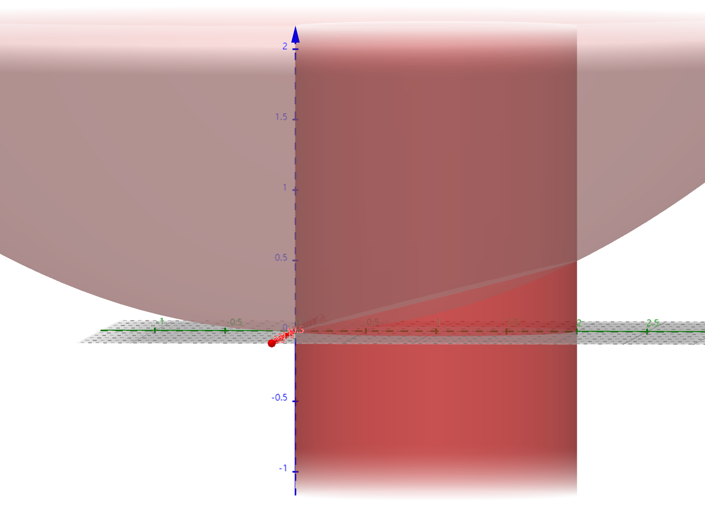
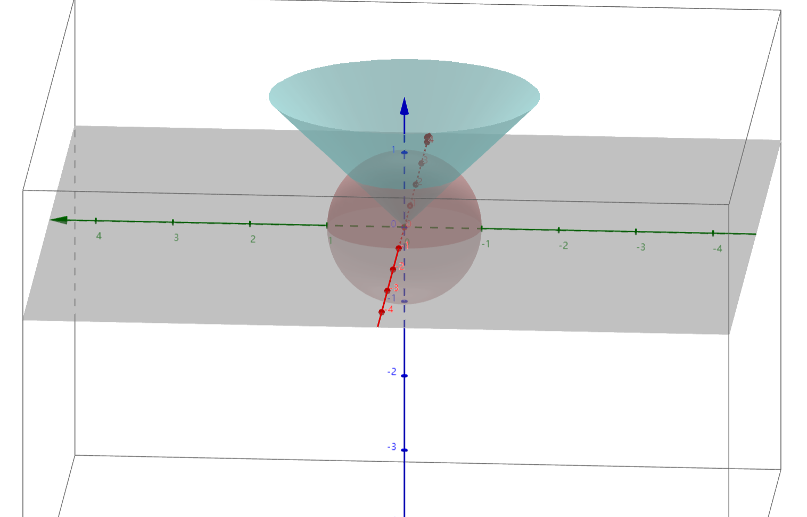

## 一.三重积分
### 概念: 可爱因子简化版

$$\begin{align}
    \iiint_{\Omega} g(x,y,z) dxdydz = \lim_{n\rightarrow \infty} \sum_{i=0}^n\sum_{j=0}^n\sum_{k=0}^n g(\frac{i}{n},\frac{j}{n},\frac{k}{n}) \frac{1}{n} \frac{1}{n}\frac{1}{n}
\end{align}$$

## 二.计算方法
### 1.投影形(先一后二)
常见累次积分法,通过上下竖线来得到沿着 $z$ 的一条直线的质量,在通过将每条直线的质量求和得到

$$\begin{align}
    \iiint_{\Omega} f(x,y,z) dV = \iint_{D_{xy}} d\sigma \int^{z_1(x,y)}_{z_2(x,y)} f(x,y,z) dz
\end{align}$$

这种方法比较适用于围绕三维体的上下曲面是可解析的.
同理:

$$\begin{align}
    \iiint_{\Omega} f(x,y,z) dV &= \iint_{D_{xy}} d\sigma \int^{z_1(x,y)}_{z_2(x,y)} f(x,y,z) dz \\
    &= \iint_{D_{zx}} d\sigma \int^{y_1(z,x)}_{y_2(z,x)} f(x,y,z) dy \\
    &= \iint_{D_{yz}} d\sigma \int^{x_1(y,z)}_{x_2(y,z)} f(x,y,z) dx \\
\end{align}$$

可结合柱坐标,球坐标,仿射变换等等变量替换简化积分.

### 2.先二后一法
如果已知在 $z = z_0$ 的面积 $D_{z_0}$ 可带得到在 $z = z_0$ 处横截面的质量,

$$\begin{align}
    A(z_0) = \iint_{D_{z_0}} f(x,y,z_0) dxdy 
\end{align}$$

再通过对每一个横截面的质量求和有

$$\begin{align}
    \int^{z_1}_{z_2} A(z) dz
\end{align}$$

得到三维体积的质量,即

$$\begin{align}
    \iiint_{\Omega} f(x,y,z) dV = \int^{z_1}_{z_2} dz\iint_{D_{z}} f(x,y,z) dxdy
\end{align}$$

同理:

$$\begin{align}
    \iiint_{\Omega} f(x,y,z) dV &= \int^{z_1}_{z_2} dz\iint_{D_{z}} f(x,y,z) dxdy\\
    &= \int^{y_1}_{y_2} dy\iint_{D_{y}} f(x,y,z) dzdx\\
    &= \int^{x_1}_{x_2} dx\iint_{D_{x}} f(x,y,z) dydz
\end{align}$$

在 $dxdy$ 时将 $z$ 看成一个常数,利用各个图形的面积公式求 $D_{z}$ ,这种方法比较适用于已知 $D_z$ 为规则图形(三角形,正方形,圆)累计的三维体(简单又好看).常用方法如下:
#### 2.1 三角形

$$\begin{align}
    ax + by \leq f(z)
\end{align}$$

利用截距式得到 $x = \frac{f(z)}{a} , y = \frac{f(z)}{b}$ ,得到截面面积: $A(z) = \displaystyle \frac{xy}{2} = \frac{f^2(z)}{2ab}$

#### 2.2 圆

$$\begin{align}
    x^2 + y^2 \leq f^2(z)
\end{align}$$

得到截面面积: $A(z) = \displaystyle \pi f^2(z)$ ,得到它的截面面积为: $A(z) = \displaystyle \pi ab f^2(z)$

#### 2.3 椭圆

$$\begin{align}
    \frac{x^2}{a^2} + \frac{y^2}{b^2} \leq f^2(z)
\end{align}$$

例如:
1.由 $3x + 4y + 2z = 1$ 和 $x,y,z$ 轴围成的立体 $\Omega : \left\{(x,y)| 3x + 4y + 2z \leq 1 , x\geq 0 , y\geq 0 ,z \geq 0\right\}$,可以写为

$$\begin{align}
    3x + 4y  \leq 1 - 2z
\end{align}$$

此时

$$\begin{align}
    D_{z} = \frac{xy}{2} = \frac{(1 - 2z)}{3} \frac{1 - 2z}{4} \frac{1}{2}
\end{align}$$

2.由 $\frac{x^2}{a^2} + \frac{y^2}{b^2}+\frac{z^2}{c^2} \leq 1$ 所围成的立体,它的截面有

$$\begin{align}
    \frac{x^2}{a^2} + \frac{y^2}{b^2} \leq 1 - \frac{z^2}{c^2}
\end{align}$$

得到截面面积为:

$$\begin{align}
    A(z) = \pi ab(1 - \frac{z^2}{c^2})
\end{align}$$

最后:再次说明一下,先二后一的方法的条件:a.特别简单的图形,每一个截面都是可计算的,b.被积函数简单,通常是最后变量的函数;一般在计算质心的时候很常用;一般都是用先一后二法.

### 3.换元法

$$\begin{cases}
    x = x(u,v,w) \\
    y = y(u,v,w) \\
    z = z(u,v,w)
\end{cases}$$

则有:

$$\begin{align}
    \iiint_{\Omega} g(x,y,z) dxdydz = \iiint_{\Omega} g(x(u,v,w),y(u,v,w),z(u,v,w)) \begin{vmatrix}
        \frac{\partial(x,y,z)}{\partial(u,v,w)}
    \end{vmatrix}dudvdw
\end{align}$$

常见换元

$$\begin{align}
    dV = dxdydz = rdrd\theta dz = r^2sin \varphi drd\theta d \varphi
\end{align}$$

其中:
#### 3.1 柱坐标

$$\begin{align}
    x &= r\cos \theta \\
    y &= r \sin \theta \\
    z &= z
\end{align}$$

其中 $r \in [0,+\infty] , \theta \in [0,2\pi] , z \in (-\infty,+\infty)$
#### 3.2 球坐标

$$\begin{align}
    x &= r\cos \theta \sin \varphi \\
    y &= r \sin \theta \sin \varphi\\
    z &= z\cos \varphi
\end{align}$$

$r \in [0,+\infty] , \theta \in [0,2\pi] , \varphi \in [0,\pi]$

## 三.例题
### 例题 1
设 $\Omega$ 是由平面 $x+y+z=1$ 与三个坐标系所围成的空间区域,求 $ \displaystyle \iiint_{\Omega} (x+2y+3z) dxdydz$.
解:
方法一:
由于区域是轮换对称的,所以:

$$\begin{align}
    \iiint_{\Omega} (x+2y+3z) dxdydz &= 6\iiint_{\Omega} z dxdydz \\
    &= 6\int^1_0 dx\int^{1-x}_0 dy\int^{1-x-y}_0 z dz \\
    &= 6\frac{1}{2}\int^1_0\int^{1-x}_0 (1 - x - y)^2 dy \\
    &= 6\frac{1}{2}\int^1_0 -\frac{1}{3}(1 - x - y)^3|^{1 - x}_0 dx \\
    &= 6\frac{1}{6} \int^1_0 (1 - x)^3 dx \\
    &= 6\frac{1}{24} =\frac{1}{4}
\end{align}$$

方法二:
因为区域中的 $dz$ 相匹配的 $S = \frac{x_0y_0}{2}$ ,有因为 $x + y = 1 - z \rightarrow x_0 = y_0 = 1-z \rightarrow S = \frac{(1-z)^2}{2}$ ,故有:

$$\begin{align}
    \iiint_{\Omega} (x+2y+3z) dxdydz &= 6\iiint_{\Omega} z dxdydz \\
    &= 6\int^1_0 z dz\iint_{D_{xy}} dxdy \\
    &= 6\int^1_0 z\frac{(1-z)^2}{2} dz \\
    &=3\int^1_0(z - 2z^2 + z^3) dz\\
    &=3(\frac{1}{2} - \frac{2}{3} + \frac{1}{4}) \\
    &= \frac{1}{4}
\end{align}$$

附注:不要看到等式就急着带进去,多思考积分区域.

### 例题 2
设 $\Omega$ 是由柱面 $x^2+(y-1)^2 =1$ 与旋转抛物面$8z = x^2 + y^2$ 以及平面 $z= 0$ 所围成的空间区域,求 $ \displaystyle \iiint_{\Omega} \sqrt{x^2 + y^2}dxdydz$.
解:

利用投影法得到投影 $D_{x,y} = \left\{(x,y)|x^2+(y-1)^2 \leq 1\right\} \rightarrow x^2 + y^2  \leq 2y$,故有:

$$\begin{align}
    \iiint_{\Omega} \sqrt{x^2 + y^2}dxdydz &= \iint_{D_{xy}}\sqrt{x^2 + y^2}dxdy\int^{\frac{x^2 + y^2}{8}}_0 dz \\
    &= \iint_{D_{xy}}\frac{(x^2+y^2)^{\frac{3}{2}}}{8}dxdy
\end{align}$$

令

$$\begin{cases}
    x = r\cos \theta \\
    y = r\sin \theta 
\end{cases} \rightarrow \begin{align*}
    |\frac{\partial(x,y)}{\partial(r,\theta)}| = r
\end{align*}$$

从而有:

$$\begin{align}
    \iint_{D_{xy}}\frac{(x^2+y^2)^{\frac{3}{2}}}{8}dxdy &= \int^{\frac{\pi}{2}}_{\frac{-\pi}{2}} d\theta \int^{2\sin \theta}_0\frac{r^4}{8} dr \\
    &= \frac{1}{40} \int^{\frac{\pi}{2}}_{\frac{-\pi}{2}} 2^5 \sin^5\theta d \theta \\
    &= \frac{64}{40} \int^{\frac{\pi}{2}}_0 \sin^5\theta d\theta \\
    &= \frac{8}{5} \frac{4}{5} \frac{2}{3} \\
    &= \frac{64}{75}
\end{align}$$

### 例题 3
计算 $I = \iiint_{\Omega}|\sqrt{x^2 + y^2 + z^2} - 1| dV$ ,其中 $\Omega : \sqrt{x^2 + y^2} \leq z \leq 1$.
这里有两个方面给要考虑:就是绝对值导致的积分区域的不同:

$$\begin{align}
    \Omega_1 &= {(x,y,z) | \sqrt{x^2 + y^2 + z^2} \leq 1 ,(x,y,z) \in \Omega} \\
    \Omega_2 &= {(x,y,z) | \sqrt{x^2 + y^2 + z^2} \geq 1 ,(x,y,z) \in \Omega} \\
\end{align}$$

这里得到 $x^2 + y^2 + z^2 = 1$ 与 $z = \sqrt{x^2 + y^2}$ 的交线为:

$$\begin{align}
    x^2 + y^2 = \frac{1}{2} \rightarrow z = \sqrt{x^2 + y^2} = \frac{\sqrt{2}}{2}
\end{align}$$

由于 $z = \sqrt{x^2 + y^2}$ 可以看作 $z = y$ 绕z轴旋转的旋转体,故旋转体 $z = \sqrt{x^2 + y^2}$ 与 $xOy$ 的夹角为 $\frac{\pi}{4}$

则有：

$$\begin{align}
    I &= \iiint_{\Omega}|\sqrt{x^2 + y^2 + z^2} - 1| dV \\
    &=  \iiint_{\Omega_2}\sqrt{x^2 + y^2 + z^2} - 1 dV + \iiint_{\Omega_1}1 - \sqrt{x^2 + y^2 + z^2} dV
\end{align}$$

又由于被积函数 $|\sqrt{x^2 + y^2 + z^2} - 1|$ 是关于 $x,y$ 的偶函数,而积分区域关于 $xOz,yOz$ ,故令 $\Omega'$ 为 $\Omega$ 在第一卦限的空间区域(同理对于$\Omega_1',\Omega_2'$) :

$$\begin{align}
    I &= 4\iiint_{\Omega'}|\sqrt{x^2 + y^2 + z^2} - 1| dV \\
    &=  4\iiint_{\Omega_2'}\sqrt{x^2 + y^2 + z^2} - 1 dV + \iiint_{\Omega_1'}1 - \sqrt{x^2 + y^2 + z^2} dV
\end{align}$$

利用代换:

$$\begin{cases}
    x = r\sin \varphi \cos \theta\\
    y = r\sin \varphi \cos \theta \\
    z = r\cos \varphi
\end{cases} \rightarrow dxdydz = r^2 \sin\varphi drdr\varphi d\theta $$

则有

$$\begin{align}
    &4\iiint_{\Omega_2'}\sqrt{x^2 + y^2 + z^2} - 1 dV + \iiint_{\Omega_1'}1 - \sqrt{x^2 + y^2 + z^2} dV \\
    &= 4 \int^{\frac{\pi}{2}}_0d\theta \int^{\frac{\pi}{4}}_0 d\varphi \int^{\frac{1}{\cos \varphi}}_1 (1 - r)r^2\sin \varphi dr + 4 \int^{\frac{\pi}{2}}_0d\theta \int^{\frac{\pi}{4}}_0 d\varphi \int^1_0 (1 - r)r^2\sin \varphi dr \\
    &=\frac{\pi}{6}(\sqrt{2} - 1)
\end{align}$$

